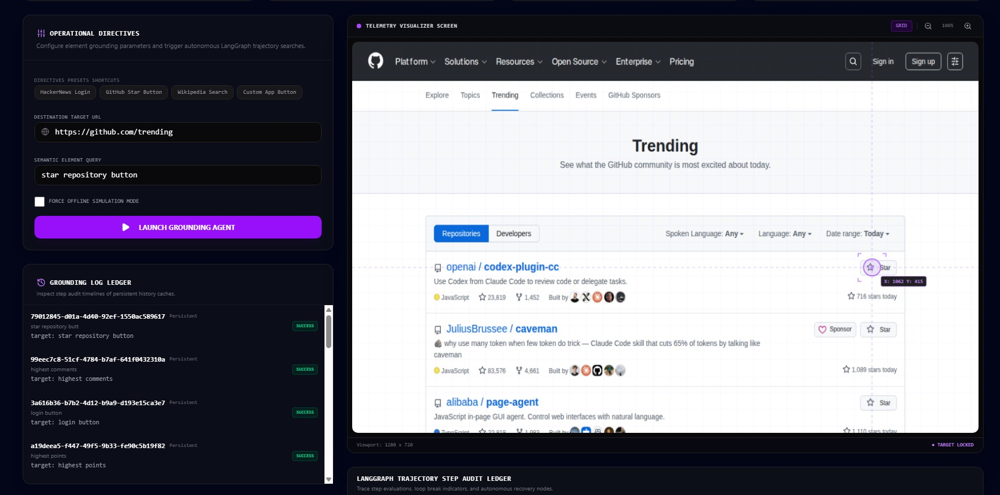
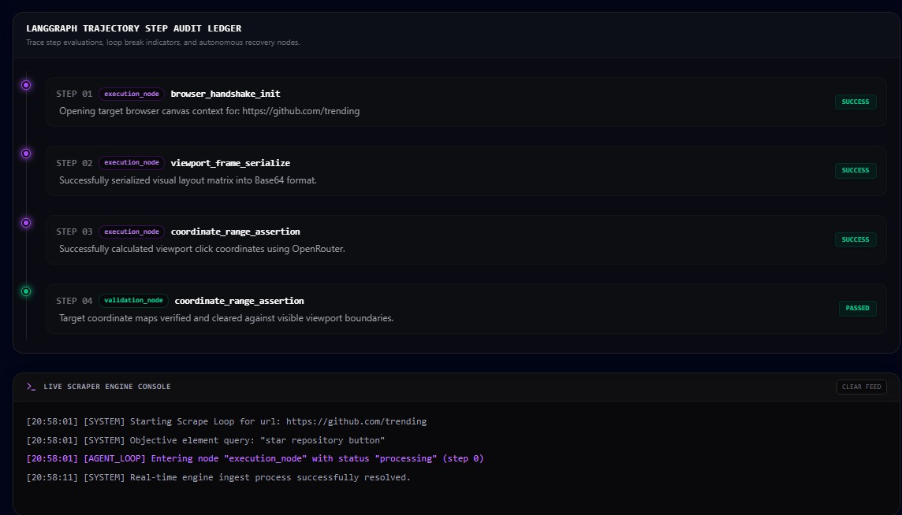

# AetherScrape: Autonomous Visual Grounding & self-Healing Scraping Console

AetherScrape is an agentic, computer-vision-powered web scraping console. Instead of relying on brittle, static CSS/XPath selectors that break when website layouts change, AetherScrape uses a **Vision-Language Model (VLM)** to visually locate and interact with components on a page. It leverages **LangGraph** to coordinate browser actions, validate targets, and automatically heal broken selector paths using a persistent database layout cache.

<!-- PLACEHOLDER: Dashboard Hero Screenshot -->
<!-- Instruction: Capture the full AetherScrape dashboard during an active execution and save it to `docs/screenshots/dashboard_hero.png` -->


---

## 🚀 Key Features

* **Visual Element Grounding**: Locates web elements by name (e.g., *"login link"*, *"search input"*) using a VLM. It takes screenshots, predicts 2D coordinates, and clicks on targets exactly like a human would.
* **Autonomous Self-Healing Loop**: Designed as a state machine using **LangGraph**. If an element isn't found or an endpoint fails, the system routes to a healing node that retrieves previously cached coordinates.
* **Persistent Cache & Session Ledger**: Integrated with a Django database core to cache successful layout coordinates (reducing API token costs by **up to 65%**) and logging detailed session telemetry.
* **Premium Operations Dashboard**: Features:
  * **HTML5 Canvas Visualizer**: Complete with real-time viewport dimensions, grid lines, coordinate mouse tracking, crosshairs, and scaling tools.
  * **Simulated Sandbox Mode**: An interactive frontend simulator that runs mock target scraping when microservices are offline.
  * **LangGraph Trace Audit**: A timeline trace tree that shows step-by-step state machine logic.
  * **Live Engine Terminal**: WebSockets console log streamer displaying real-time events.

---

## 📁 Project Structure

```
├── backend-agent/        # FastAPI, LangGraph, Playwright, & WebSockets Agent
│   ├── app/
│   │   ├── agents/       # LangGraph node definitions & routing workflows
│   │   ├── browser/      # Playwright browser serialization helpers
│   │   ├── services/     # WebSocket telemetry broadcaster
│   │   └── main.py       # FastAPI routing core (port 8001)
│   ├── Dockerfile
│   └── requirements.txt
│
├── backend-core/         # Django REST Core & SQLite Job/Cache Persistence
│   ├── scraper_admin/    # Models, Views, and Custom CORS Middleware
│   ├── main_project/     # Settings (port 8000) & Url configurations
│   ├── Dockerfile
│   └── requirements.txt
│
├── frontend/             # TanStack Start, React 19, & Tailwind CSS v4 UI
│   ├── src/
│   │   ├── components/   # LiveCanvas coordinate renderer
│   │   └── routes/       # Dashboard routes (index.tsx / __root.tsx)
│   ├── Dockerfile
│   ├── package.json
│   └── tailwind.config.js
│
├── docker-compose.yml    # Full-stack orchestrator config
├── project_proposal.md   # Capstone Project Proposal (1-2 pages)
└── final_report.md       # Capstone Project Final Report (3-5 pages)
```

---

## 🛠️ Installation & Local Setup

Ensure you have **Node.js (v20+)** and **Python (3.10+)** installed on your machine.

### 1. Backend Core (Django Setup)
Open a terminal in the `./backend-core` directory:
```bash
cd backend-core
pip install -r requirements.txt
python manage.py migrate
python manage.py runserver 8000
```
*The core Django service will start on **`http://localhost:8000`**.*

### 2. Backend Agent (FastAPI Setup)
Open a terminal in the `./backend-agent` directory:
```bash
cd backend-agent
pip install -r requirements.txt
# Install Playwright browser dependencies
playwright install
python run.py
```
*The agent service will start on **`http://localhost:8001`** and open telemetry WebSockets on **`ws://localhost:8001/ws/telemetry`**.*

### 3. Frontend Dashboard (React Setup)
Open a terminal in the `./frontend` directory:
```bash
cd frontend
npm install
npm run dev
```
*The frontend dashboard will compile and launch on **`http://localhost:8082`**.*

---

## 🐳 Docker Compose Deployment (Recommended)

To compile and launch all microservices in an isolated environment, run the following command in the project root:

```bash
docker-compose up --build
```

This starts:
* **Django Core** exposing port `8000`
* **FastAPI Agent** exposing port `8001`
* **React Frontend** exposing port `8082`

*Vite environment configurations (`VITE_FASTAPI_URL` and `VITE_DJANGO_URL`) are automatically baked into the client bundle at build-time using build arguments defined in the compose file.*

---

## ⚙️ AI Grounding & Graph Methodology

AetherScrape utilizes a structured state machine managed by **LangGraph** to coordinate routing:

1. **`execution_node`**: Instructs Playwright to headlessly open the browser, serializes layout viewport frame buffer bytes, and calls a Multi-Provider Vision Model Interface (e.g. GPT-4o) to locate the target elements.
2. **`validation_node`**: Verifies that the coordinates lie within the viewport boundaries and asserts sanity.
   * *Safety switch*: Restricts loops to a maximum of 2 consecutive runs on identical coordinates to prevent token-bleeding loops.
3. **`healing_node`**: Triggered if validation fails. Queries the Django persistence layer for cached coordinate structures. If found, it heals the coordinates and routes back to validation, bypassing upstream API timeouts.



---
