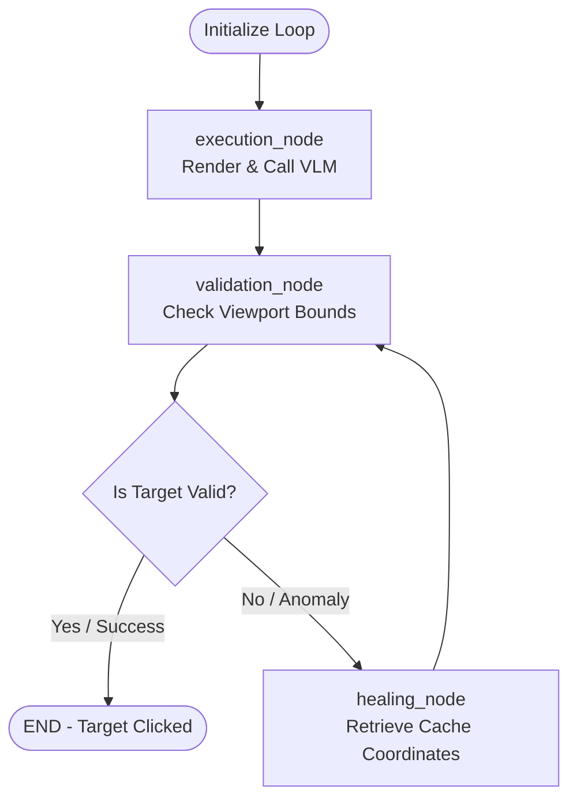

# Project Proposal: Autonomous Visual Grounding & Agentic Web Scraping System

**Course Module 26:** Capstone Project Proposal  
**Project Name:** AetherScrape Visual Grounding Console  
**Domain:** Artificial Intelligence, Computer Vision, & Web Automation  

---

## 1. Problem Statement
Web scraping is a foundational pillar of modern data science, business intelligence, and market analysis, providing the raw data feeds required for training AI models, monitoring competitive pricing, and aggregating news. However, traditional web harvesting techniques (e.g., using BeautifulSoup, Scrapy, or Selenium with static CSS selectors and XPaths) suffer from a critical vulnerability: **structural fragility**.

### The Brittle Nature of Declarative Locators
Classic scrapers rely on the document object model (DOM) tree structure. If a target website undergoes a frontend rewrite, refactors its CSS classes (such as moving from standard CSS to randomized Tailwind utility classes in a new build), or updates its HTML layout nesting, the selectors immediately break.
* **Frequent Layout Drift:** Modern web apps change their class names dynamically on compile, making hardcoded selectors obsolete. A single changed class name or div wrapper breaks rigid CSS selectors, causing data pipelines to fail silently or crash.
* **Maintenance Overhead:** Developers spend countless hours diagnosing broken scrapers, updating XPath targets, and redeploying code.
* **Anti-Scraping & Dynamic Barriers:** Cookie consent banners, modal popups, and multi-step interactive forms are difficult to handle with declarative scrapers, requiring complex conditional logic scripts.
* **API Cost Inefficiencies:** While modern Vision-Language Models (VLMs) can locate elements visually, querying them repeatedly for static pages causes token cost bleed and high network latency.

There is a critical need for an **autonomous, self-healing web scraping agent** that can visually locate elements just like a human eye does, validate coordinate assertions, heal locator drifts, and cache coordinates for maximum cost efficiency.

---

## 2. Proposed Solution & Innovation
**AetherScrape** is an autonomous web scraping system that combines computer vision, agentic state workflows, and persistent caching. Instead of relying on brittle class names, it uses a **Vision-Language Model (VLM)** to ground semantic text queries (e.g., *"click the login button"*) into physical coordinate targets on the screen.

```
       +-------------------------------------------------------+
       |                  React Frontend Dashboard             |
       |  (Visual Canvas / Trajectory Audits / Console Logs)  |
       +----------------------------+--------------------------+
                                    |
                 HTTP (REST API) & WebSockets
                                    |
          +-------------------------+--------------------------+
          |                                                    |
          v                                                    v
+-------------------------+                          +-------------------------+
|  FastAPI Backend Agent  |                          |  Django Persistence DB  |
|  (LangGraph Agent loop  | <--- Sync Session State  | (Visual Layout Cache /  |
|   Playwright & VLM)     |      & Telemetry Logs -> |  Historical Job Ledger) |
+-------------------------+                          +-------------------------+
```

### Key Engineering Innovations:
1. **Visual Element Grounding:** Renders pages headlessly, serializes the viewport layout into an image, and uses a VLM to locate click targets as 2D bounding boxes.
2. **Self-Healing Trajectory (LangGraph):** Organizes the scraping process into an agentic graph structure. If a coordinate validation fails, the agent routes to a healing node that retrieves persisted layout coordinate cache boundaries, bypassing upstream model failure.
3. **Ledger & Cache Sync:** A persistent Django service acts as a layout cache and job ledger, storing coordinates for frequently scraped pages to reduce API token costs.
4. **Operations Control Center:** A professional dashboard providing real-time canvas coordinate monitoring, LangGraph timeline trace audits, and scrolling engine terminal logs.

---

## 3. Technology Stack & Microservices

The architecture is built on a distributed microservice framework to decouple long-running browser sessions from database operations:

* **Frontend Dashboard (React 19 & TanStack Start):** 
  * Builds a state-of-the-art developer operations console.
  * Features a custom HTML5 canvas telemetry monitor that overlays coordinate boxes, grid systems, crosshairs, and mouse hover position readouts.
  * Implements a local simulated sandbox engine that mimics scraping runs, allowing interactive demonstrations even when the backend APIs are offline.
* **AI Telemetry Backend Agent (FastAPI):**
  * Launches headless browser viewports via **Playwright**.
  * Executes the **LangGraph** state machine logic and orchestrates API calls to upstream VLMs (such as GPT-4o).
  * Opens a **WebSocket** server (`/ws/telemetry`) to stream real-time logging telemetry directly to the frontend.
* **Core Persistence Ledger (Django & SQLite):**
  * Manages database records for executed jobs and details steps.
  * Holds the **Visual Layout Cache** coordinates table, matching target URLs and elements to absolute coordinates to facilitate self-healing and token conservation.
  * Uses custom, zero-dependency CORS middleware to enable secure browser-based API fetches.
* **Orchestration (Docker & Docker Compose):**
  * Bundles all microservices into containers.
  * Bakes environment variables (`VITE_FASTAPI_URL`, `VITE_DJANGO_URL`) directly into the compiled client bundle using Docker build args.

---

## 4. AI/ML Grounding & Graph Methodology

### Visual Grounding Coordinate Calculation
When the agent receives a target element query (e.g. `"login button"`), it captures the browser viewport screenshot as a Base64 image. The VLM processes the image and outputs a normalized bounding box:
$$\text{Box} = [y_{\min}, x_{\min}, y_{\max}, x_{\max}]$$
The absolute click target centroid $(X_c, Y_c)$ in pixels is calculated by mapping the normalized center coordinates to the physical dimensions of the browser viewport:
$$X_c = \left(\frac{x_{\min} + x_{\max}}{2000}\right) \times \text{Viewport Width}$$
$$Y_c = \left(\frac{y_{\min} + y_{\max}}{2000}\right) \times \text{Viewport Height}$$

### Agentic State Orchestration (LangGraph)
The scraping session is compiled as a deterministic state machine using LangGraph to handle conditional routing and validation:



1. **`execution_node`**: Instantiates the headless browser, takes the screenshot, and queries the VLM to obtain coordinate bounding boxes.
2. **`validation_node`**: Asserts that the coordinates lie within the viewport boundaries and increment execution tracking.
   * *Circuit Breaker*: Kills the loop if identical coordinates are returned more than twice, preventing infinite billing cycles.
3. **`healing_node`**: Retrieves coordinates from the Django persistent cache. If coordinates match, the target is healed and routed back to validation, bypassing upstream model calls.
